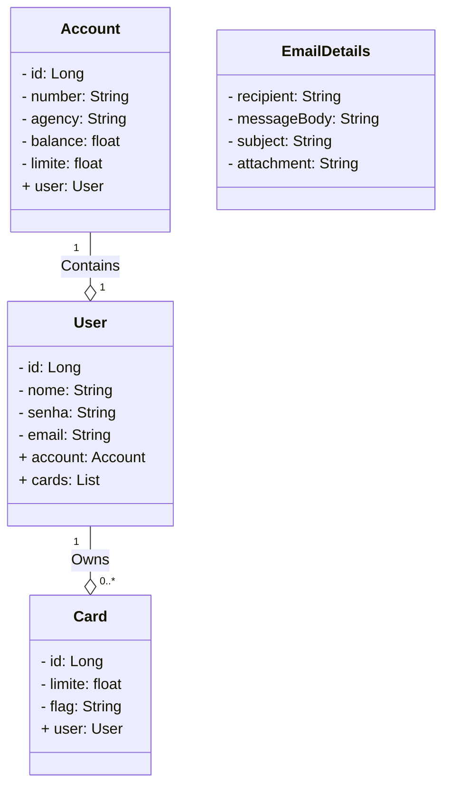

# dio-bank
Banco criado para prática dos conhecimentos aprendidos no Bootcamp Santander pela DIO.

## A Ideia
Como há bootcamps e outras ferramentas incríveis que são pagas, foi pensado em criar um próprio banco da DIO, para ajudar pessoas, que ou não possuem cartão de crédito próprio ou não possuem limite,
a terem uma forma de pagamento mais flex.

## Diagrama de Classes


## Tecnologias Utilizadas

- Java 20
- Spring Boot
- Spring Data JPA
- Lombok
- MySQL (Prod)
- H2 (Dev)
- JavaMail

## Organização das classes


## Demonstração
Email que é enviado automaticamente quando cadastramos uma conta:
<br>


## Funcionalidades
- Criar uma conta bancária
- Visualização de contas
- Visualizar o extrato da conta
- Associar cartões a uma conta
- Enviar e-mail de confirmação de cadastro.

## Estrutura do Projeto

O projeto é dividido nas seguintes classes principais:

- `Account`: Representa uma conta bancária.
- `User`: Representa um usuário do banco e está associado a uma conta.
- `Card`: Representa cartões associados a um usuário.
- `EmailDetails`: Classe auxiliar para enviar e-mails com anexos.

## Implementações Futuras
O Projeto está apenas com implementações simples de cada recursos que temos, logo será atualizado com mais métodos relacionados a usuário, conta e cartão.
Além da adição de Spring Security.

## Como Usar

1. Clone o repositório:

   ```bash
   git clone https://github.com/brielsene/dio-bank.git

## Redes Sociais
- Linkedin
  <br>
https://www.linkedin.com/in/gabrielsenec


