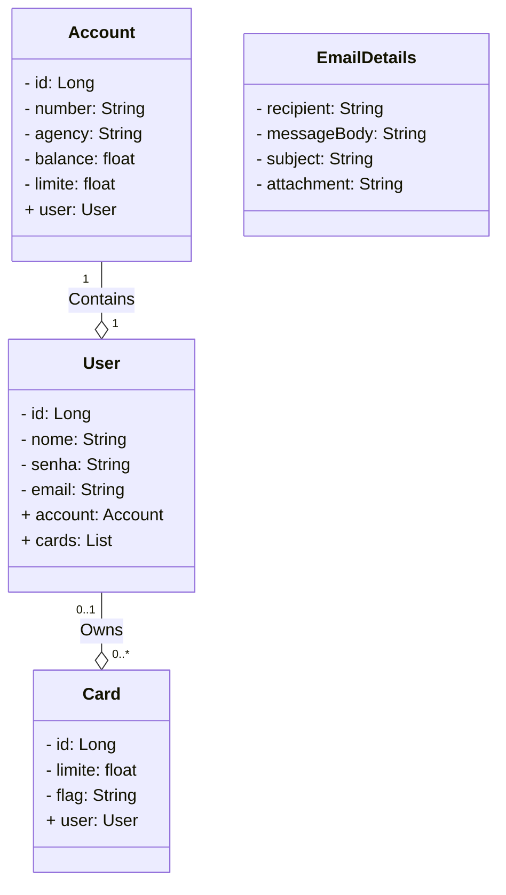

# dio-bank
Banco criado para prática dos conhecimentos aprendidos no Bootcamp Santander pela DIO.

## A Ideia
Como há bootcamps e outras ferramentas incríveis que são pagas, foi pensado em criar um próprio banco da DIO, para ajudar pessoas, que ou não possuem cartão de crédito próprio ou não possuem limite,
a terem uma forma de pagamento mais flex.

## Diagrama de Classes

